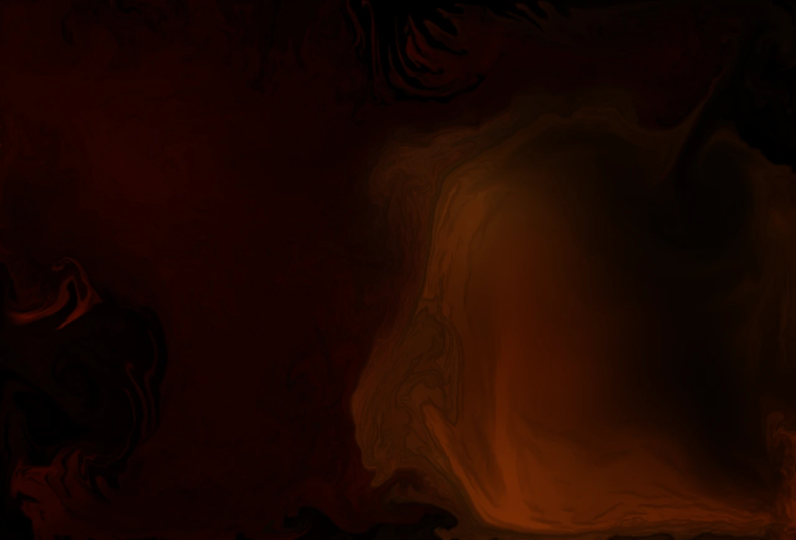
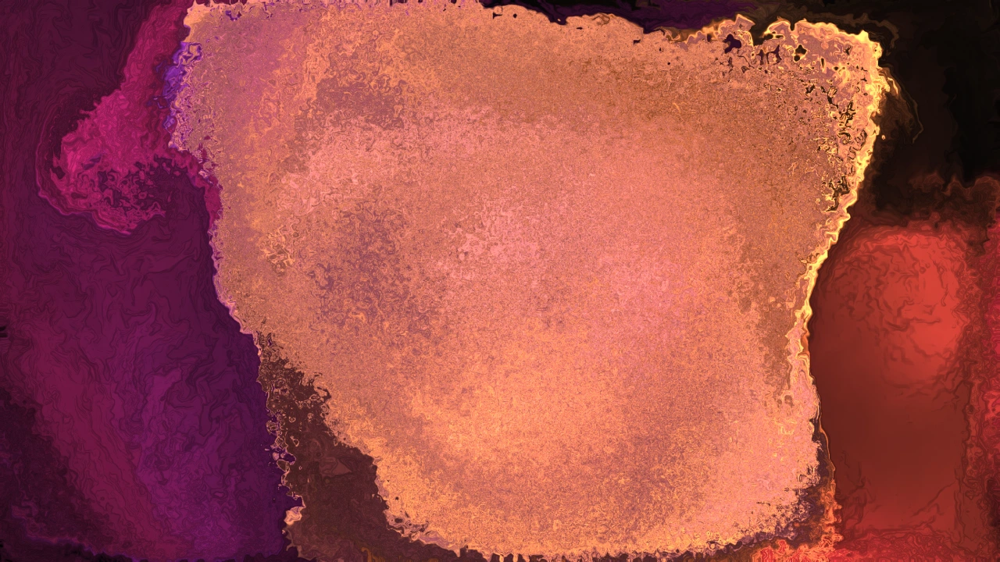
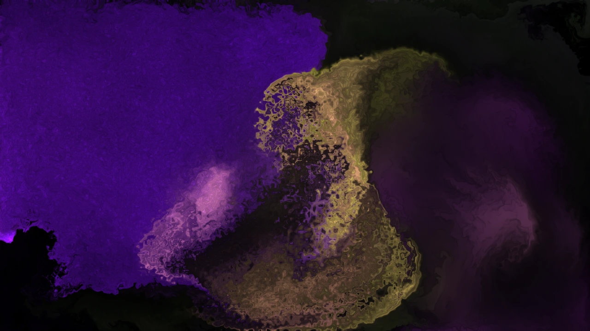

# Fluid Music Visualizer

A music visualizer that drives a real fluid simulation from the sound, and renders it to
video frame-accurately.

The simulation is **[Pavel Dobryakov's WebGL-Fluid-Simulation](https://github.com/PavelDoGreat/WebGL-Fluid-Simulation)**,
used under the MIT licence and vendored unmodified so the changes stay reviewable against
it. The fluid dynamics and every line of GLSL are his work. See
[Credit](#credit) and [`NOTICE.md`](./NOTICE.md).

```bash
npm install
npm run dev     # http://localhost:5173
```

Drag an audio file onto the window. Nothing is uploaded anywhere; decoding and analysis
happen in your browser.



<p align="center">
  
  
</p>

<p align="center"><em>Three frames from one track. Every still is a real render — nothing was posed or
retouched. The audio is not included; see <a href="#credit">Credit</a>.</em></p>

---

## What you are looking at

Most visualizers react to *loudness*. This one draws **the change in the sound**.

Every frame, each point on the frequency axis is compared with where it was a fixed moment
earlier, and whatever rose is drawn. That is the whole mechanism — there is no beat
detector, no threshold, and nothing that decides whether a sound "counts" before drawing
it. A kick is a large rise near the bottom of the range and so draws itself as one.

Twelve readers sit along the frequency axis, and each pushes the fluid according to what
rose at its position. Where and how they push is measured, not decorative:

| you see | it means |
|---|---|
| **height** | pitch — low sounds low, high sounds high |
| **horizontal** | how long that frequency sustains: percussive on the left, ringing on the right |
| **sideways drift** | the stereo image. A hard-panned sound really does appear off to that side |
| **colour** | frequency, through the palette — rotated by the harmony |
| **scatter** | noisiness. A snare scatters, a bass note keeps its ring |
| **size and force** | how much rose, and how low it was |

Colour follows **harmony**, not just brightness. The spectrum is folded by octave into the
twelve pitch classes, which are placed around the colour wheel by fifths — so a I–V change
is a small hue step and a distant modulation is a large one. A held chord commits to a
colour; a drum break barely moves it.

On top of that, two slower layers read the shape of the track:

- **Atmospheres** — each section of the track is matched to one of six looks (velocity,
  vorticity, dissipation, dye, palette) based on its own measurements. A breakdown and a
  drop are categorically different, not just brighter or dimmer.
- **Arc** — tension, anticipation and release. The picture tightens *before* a drop and
  lets go on it, because the whole track is analysed up front and the mapping can read
  ahead.

---

## Using it

### Loading audio

Drag a file onto the window at any time, or press `O`. For a quick-pick menu, drop files
into `music/` and restart the dev server.

**`music/` is gitignored** — no audio is ever committed.

Long files work: a 57-minute DJ mix loads, analyses into 413k frames and plays. Decoding
is pinned to 48 kHz rather than the sound card's rate, because on a 96 kHz device an hour
of stereo needs 2.65 GB and fails.

### Keys

| key | |
|---|---|
| `space` | play / pause |
| `←` `→` | seek ∓5 s |
| `D` | analysis overlay — flux, thresholds, onset ticks coloured by pitch, beat grid |
| `O` | open another track |
| `E` | export panel (`Esc` closes) |
| `C` | clear the dye |
| `P` | freeze the simulation, but not the audio |

Drag on the canvas to splat by hand, at any time.

### The interface

The transport bar, the key hints and the simulation panel all fade out together while the
mouse is still, and come back when you move it.

The seek bar is **segmented by section and coloured by the atmosphere each one was
assigned**, so the shape of the track is visible at a glance and clicking a segment jumps
straight to it — the practical way to compare one atmosphere against another. The badge
shows the current atmosphere and posture. The dropdowns pin the palette or atmosphere;
`auto` hands each back to the analysis.

The **Simulation** panel, top right, exposes the raw fluid parameters. Everything the
mapping drives updates live, so you can watch vorticity and dissipation move on their own.

Bloom is off by default. It reads as light when splats are sparse, but this fills the
frame with dye continuously, so the glow spreads between neighbouring colours and softens
exactly the structure the fluid is there to show. Turn it on in the panel and it is fully
modulated.

---

## Export

Press `E`. Two paths, named for what they guarantee rather than for their format.

**Render** steps the simulation at a fixed rate on its own canvas and GL context, so every
frame is present and the result is reproducible. Measured at 1080p60: **3.2× faster than
realtime**, 193 fps sustained, so a 2½-minute track takes under a minute. H.264 in MP4
with AAC audio, streamed to disk through the File System Access API so memory stays flat —
buffering a 3-minute 1080p60 render would be 89 GB of raw frames.

**Record** captures the live canvas in realtime with sound. Fine for a quick clip; any
stutter is baked in permanently.

### Quality

Renders are encoded at **constant quality**, not constant bitrate. A bitrate target is an
average, and rate control holds that average by taking quality away from exactly the
passages that need it most: at a 40 Mbps target, four seconds of quiet intro came out
30.9 Mbps and four seconds of drop came out 29.5 — within 4% of each other, although one
is far harder to encode.

The quality setting instead tells the encoder how good each frame must look and lets it
spend what that costs. Expect roughly **165 MB per minute** at 1080p60 on the default;
*high* roughly halves it.

---

## Tests

Run in the browser console against the dev server:

```js
await window.synthTest()        // 43 assertions vs synthesised audio with known answers
await window.selfTest()         // 42 end-to-end assertions over the tracks in music/
await window.checkDeterminism() // frame-by-frame reproducibility

// and, with a track loaded:
const { verifyRenderDeterminism } = await import('/src/export/offlineLoop.js');
await verifyRenderDeterminism({ timeline: window.timeline, seed: 0x5eed, seconds: 3 });
```

`synthTest` is the stronger of the two suites. Real tracks can only be judged; the
synthetic signals have exact answers — kick *k* lands at exactly *k*·60/bpm, the sweep's
centroid is a known function of time, the arrangement changes section at 8, 16, 32 and 40
seconds, and a closed and an open hi-hat are built from the identical noise generator so
they differ in envelope and nothing else.

It has caught a long list of real bugs: onsets reported 33 ms early, every snare drawn as
a kick, and three spectrum bins that read exactly zero in every frame of every track ever
analysed. It validates its own fixtures first, having once been misled by a "hi-hat"
accidentally filtered at 306 Hz.

---

## How it works

```
vendor/        upstream fluid simulation, unmodified, for diffing against
src/fluid/     fluidCore.js (derived) + shaders.js (extracted GLSL)
src/audio/     decode → FFT → timeline
src/mapping/   how the analysis becomes splats and simulation settings
src/export/    WebCodecs (deterministic render) and MediaRecorder (quick capture)
src/app/       render loops and input; frame.js is shared by live and export
```

**Analysis** runs in a worker: 2048-point FFT at a 400-sample hop, exactly 120 frames per
second. The bottom of the range gets a second, much finer analysis — decimating by 16
first makes a 170 ms window cheap, which is what it takes to resolve a semitone near 50 Hz.
The result is a timeline of continuous curves plus sparse events, cached in IndexedDB by
content hash so re-opening a track is instant.

**Mapping** is `src/mapping/field.js`, with `arc.js` and `atmospheres.js` for structure and
`feel.js` writing the simulation parameters.

### The fluid core is a derived file

`src/fluid/fluidCore.js` and `src/fluid/shaders.js` are generated from `vendor/script.js`:

```bash
node scripts/extract-shaders.mjs   # GLSL → shaders.js
node scripts/build-core.mjs        # the structural transform → fluidCore.js
npm run verify:core                # assert it is still only a structural transform
```

The transform is a list of line-range edits, each with a written reason. It makes the
simulation take its canvas, RNG and `dt` from the caller and own no DOM events, GUI or
`requestAnimationFrame` loop — nothing else. `verify:core` enforces that: no wall-clock
reads, no unseeded `Math.random`, no listeners, and a cap on added lines.

**New visual behaviour goes in `src/mapping/`, never in `fluidCore.js`.** Keeping the core
a mechanical transform is what lets it be re-derived if upstream ever changes. The one
deliberate change to upstream's GLSL — dithering the final image rather than only the
bloom term — lives in a documented `PATCHES` list in the extraction script, not as a hand
edit.

### Determinism

The same track, seed and machine produce the same frames: seeded RNG, fixed `dt` in the
export loop, no pointer input during export, and an awaited dithering-texture load. The
simulation and mapping draw from separate RNG streams, so a change on one side cannot
shift the other.

Not bit-exact across GPUs — the simulation runs on half-float textures. The encoded MP4
bytes are not identical between runs either, because hardware rate control adapts, so
`verifyRenderDeterminism()` hashes frames *before* encoding rather than comparing files.

---

## Credit

The fluid simulation and all of its GLSL are
**© Pavel Dobryakov**, from
[WebGL-Fluid-Simulation](https://github.com/PavelDoGreat/WebGL-Fluid-Simulation), used
under the MIT licence. This project would not exist without it.

Everything else — the audio analysis, the mapping, the export pipeline — is MIT licensed
too. See [`LICENSE`](./LICENSE) and [`NOTICE.md`](./NOTICE.md) for the details of what is
derived from what.

Built with [fft.js](https://github.com/indutny/fft.js),
[mp4-muxer](https://github.com/Vanilagy/mp4-muxer),
[webm-muxer](https://github.com/Vanilagy/webm-muxer),
[lil-gui](https://github.com/georgealways/lil-gui) and [Vite](https://vitejs.dev).
